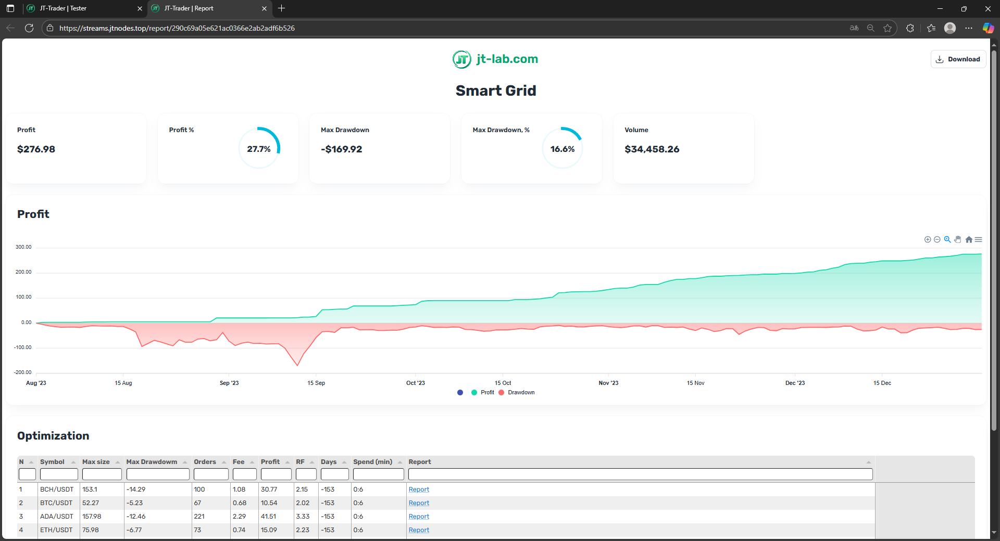
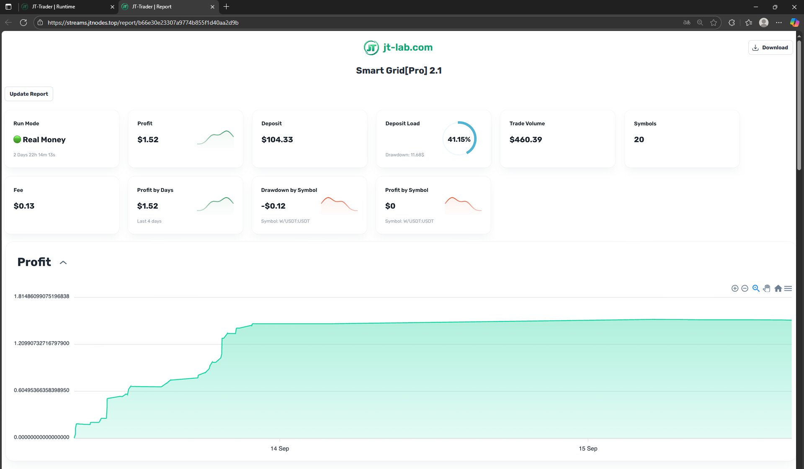

# JT-Trader: Complete Platform Overview for Algorithmic Trading

[GitHub](https://github.com/jt-lab) | [Documentation](https://docs.jt-lab.com) | [JT-Lib](https://github.com/jt-lab/jt-lib)

## What is JT-Trader?

**JT-Trader** is a professional open-source platform for algorithmic cryptocurrency trading. The platform combines a powerful engine for executing trading algorithms, a comprehensive strategy testing system, and an intuitive web interface for managing trading operations.

JT-Trader is built on the JT-Lib library and provides a complete ecosystem for creating, testing, and launching trading robots on various cryptocurrency exchanges. The platform allows both developers to create complex trading strategies and traders to use ready-made solutions for trading automation.

## Creating Trading Robots

### How the Robot Creation Process Works

Creating a trading robot in JT-Trader begins with defining a trading strategy - you decide under what conditions the robot should enter a position, when to close it, and how to manage risks. Then all the logic is written as a `Script` class in TypeScript, which inherits from `BaseScript` and contains methods for initialization, market data processing, order management, and resource cleanup. The strategy is configured through user parameters defined in `static definedArgs` - these can be position size, stop-loss and take-profit percentages, indicator periods, entry and exit prices, and any other settings that can be changed without rewriting the code. Before launching in real trading, the strategy must be tested on historical data through the built-in tester, which allows evaluating performance, finding optimal parameters, and identifying potential problems. After successful testing, the robot is launched in real-time mode through the JT-Trader web interface, where you can monitor its operation and adjust parameters during trading if necessary.

### Trading Robot Lifecycle

Each robot goes through clearly defined stages:

- **Initialization** (`onInit()`) - setting up indicators, connecting to exchanges, loading parameters
- **Data Processing** (`onTick()`) - analyzing market data and making trading decisions
- **Order Management** (`onOrderChange()`) - reacting to order status changes
- **Completion** (`onStop()`) - cleaning up resources and closing positions

### Example of a Simple Trading Robot

Here's what an RSI strategy with automatic stop-losses and take-profits looks like:

```typescript
class Script extends BaseScript {
  static definedArgs = [ // User strategy parameters
    { key: 'symbols', defaultValue: 'BTC/USDT:USDT' }, // Trading pair
    { key: 'sizeUsd', defaultValue: 100 }, // Position size in USD
    { key: 'slPercent', defaultValue: 2 }, // Stop-loss percentage
    { key: 'tpPercent', defaultValue: 4 } // Take-profit percentage
  ];

  private basket: OrdersBasket; // Order manager
  private rsi: RelativeStrengthIndex; // RSI indicator
  private sizeUsd: number;
  private slPercent: number;
  private tpPercent: number;

  async onInit() { // Initialization on startup
    this.sizeUsd = getArgNumber('sizeUsd', 100); // Load parameters
    this.slPercent = getArgNumber('slPercent', 2);
    this.tpPercent = getArgNumber('tpPercent', 4);

    this.basket = new OrdersBasket({ // Create order manager
      symbol: this.symbols[0],
      connectionName: this.connectionName
    });
    await this.basket.init();

    this.rsi = await globals.indicators.rsi(this.symbols[0], '1h', 14); // Initialize RSI
  }

  private async signal(): Promise<number> { // Trading signal logic
    const longPosition = await this.basket.getPositionBySide('long');
    if (longPosition.contracts !== 0) return 0; // If position already exists - don't trade
    
    const rsiValue = this.rsi.getValue();
    if (rsiValue < 30) return 1; // RSI < 30 - buy signal
    if (rsiValue > 70) return -1; // RSI > 70 - sell signal
    return 0; // No signal
  }

  async onTick() { // Called on every price tick
    const currentPrice = close(); // Current closing price
    const signalValue = await this.signal();
    
    if (signalValue === 1) { // Buy signal
      const contracts = this.basket.getContractsAmount(this.sizeUsd, currentPrice); // Convert USD to contracts
      const stopLoss = currentPrice * (1 - this.slPercent / 100); // Stop-loss price
      const takeProfit = currentPrice * (1 + this.tpPercent / 100); // Take-profit price
      await this.basket.buyMarket(contracts, takeProfit, stopLoss); // Buy with automatic stops
    }
    
    if (signalValue === -1) { // Sell signal
      const longPosition = await this.basket.getPositionBySide('long');
      if (longPosition.contracts > 0) { // If there's a long position
        const contracts = longPosition.contracts;
        const stopLoss = currentPrice * (1 + this.slPercent / 100); // Stop-loss for short
        const takeProfit = currentPrice * (1 - this.tpPercent / 100); // Take-profit for short
        await this.basket.sellMarket(contracts, takeProfit, stopLoss); // Sell with automatic stops
      }
    }
  }

  async onOrderChange(order: Order) { // Handle order changes
    if (order.status === 'closed') { // If order is filled
      log('Script', 'Order filled', { orderId: order.id, side: order.side }, true); // Log event
    }
  }

  async onStop() { // Cleanup on stop
    await this.basket.cancelAllOrders(); // Cancel all active orders
  }
}
```

## Strategy Testing on Historical Data


Testing on historical data is a critically important stage in developing trading strategies that allows evaluating their effectiveness before launching in real trading. The built-in tester in JT-Trader loads historical data from exchanges, reproduces market conditions of past periods, and runs your strategy on this data, accurately simulating real-time operation. You can choose the testing period, initial balance, trading pairs, and timeframes, while the system automatically accounts for fees, spreads, and slippage for the most realistic results. The tester provides detailed analytics: overall profitability, maximum drawdown, Sharpe ratio, number of trades, percentage of successful operations, and many other metrics. Especially valuable is the parameter optimization function - the tester can automatically test thousands of strategy setting combinations and find the most profitable configurations. All results are displayed as charts, tables, and reports, allowing deep analysis of strategy behavior and making an informed decision about launching it in real trading.

## Launching Robots in Real-Time

Launching trading robots in real-time is done through the JT-Trader web interface in the Runtime section, where you create a launch scenario, specifying the strategy file, exchange connection, trading pairs, and user parameters. The system automatically loads the strategy code, initializes all necessary components, and begins receiving real-time market data through WebSocket connections with exchanges. The robot works continuously, analyzing every new price tick and making trading decisions according to the logic built into it, while all actions are recorded in detailed logs with monitoring capability through the web interface. You can stop the robot at any time, change its parameters without restarting the code, view current positions and orders, and get detailed performance statistics. The system ensures reliable operation with automatic recovery after failures, connection state monitoring, and protection against critical errors, allowing robots to work stably 24/7 without constant supervision.

## Monitoring Robot Operation

Monitoring trading robot operation in JT-Trader is done through the built-in JT-Lib reporting system, which provides ready-made report templates for visualizing trading activity and strategy performance. The logging system records all robot actions with detailed information about trading operations, parameter changes, and system events, while logs can be filtered by importance levels and message types for quick search of needed information. The built-in error notification system automatically tracks critical events and problems in robot operation, sending instant alerts when abnormal situations occur. Especially powerful is the real-time debug system, which allows viewing the state of all objects inside the script - variables, indicators, positions, orders, and other strategy components, significantly simplifying debugging and optimization of trading algorithms. Additionally, configurable Telegram notifications are available, which can be set up to receive information about important events, trading changes, or reaching certain conditions directly on your mobile device, ensuring full control over trading robots even away from the computer.
