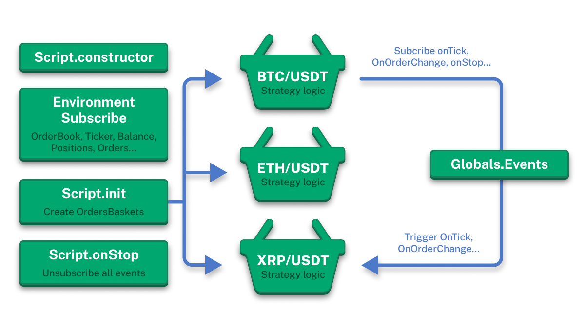

# Script Development Best Practices



## Multi-Currency Trading Bot Architecture

This section describes the key principles for creating effective and reliable trading scripts in JT-Lib, based on separation of responsibilities between the `Script` and `OrdersBasket` classes.

### Separation of Responsibilities Principle

JT-Lib architecture is built on clear role separation between two main components:

**Script Class** serves as coordinator and manager:
- Performs overall setup and configuration of trading strategy
- Defines parameters for all trading pairs (symbols)
- Creates and manages `OrdersBasket` instances for each symbol
- Monitors and controls all active baskets
- Handles global events and coordinates work between different trading pairs

**OrdersBasket Class** implements specific trading logic:
- Contains the entire algorithm and trading strategy logic for a specific symbol
- Connects to exchange and manages trading operations for one trading pair
- Handles market data, orders, and positions for its symbol
- Implements specific trading logic (grid, scalping, arbitrage, etc.)
- Works independently from other baskets, ensuring risk isolation

### Multi-Currency Architecture

The key advantage of this architecture lies in the ability to create multi-currency trading bots:

1. **One Script - Multiple Symbols**: Within one script, you can simultaneously trade on multiple trading pairs (BTC/USDT, ETH/USDT, XRP/USDT, etc.)

2. **Independent Baskets**: Each `OrdersBasket` works with one trading pair independently from others, which means:
   - Error in one basket doesn't affect others
   - Each basket can have its own parameters and settings
   - Scalability - adding new trading pairs without changing existing code

3. **Centralized Management**: Script coordinates work of all baskets through global event system, ensuring:
   - Single configuration point
   - Centralized reporting and monitoring
   - Operation synchronization when needed

### Trading Bot Lifecycle

As shown in the diagram above, the lifecycle includes the following stages:

1. **Script.constructor** - initialization of main script class
2. **Environment Subscribe** - subscription to market data (OrderBook, Ticker, Balance, Positions, Orders)
3. **Script.init** - creation of OrdersBasket instances for each symbol
4. **Script.onStop** - proper shutdown and unsubscription from all events

Each stage interacts with all active baskets through the event system, ensuring loose coupling of components and high system reliability.

This section contains recommendations and examples for creating effective and reliable trading scripts in JT-Lib.

## Script Parameter Definition

Use the static `definedArgs` property to define script parameters with default values:

```typescript
class Script extends BaseScript {
  // Define script parameters with default values
  static definedArgs = [
    {
      key: 'symbols',
      defaultValue: 'BCH/USDT,BTC/USDT,ADA/USDT,ETH/USDT,XRP/USDT',
    },
    {
      key: 'sizeUsd',
      defaultValue: 100,
    },
    {
      key: 'gridStepPercent',
      defaultValue: 5,
    },
    {
      key: 'tpPercent',
      defaultValue: 2,
    },
  ];

  // Script metadata
  name = 'Grid Bot Example';
  description = 'Multi-coin grid strategy example';
  version = 11;
}
```

## Using OrdersBasket for Trading Logic

It's recommended to extract trading logic into separate classes inheriting from `OrdersBasket`. This ensures modularity and code reusability.

### Example: GridBot Strategy

```typescript

class Script extends BaseScript {
  // Define script parameters
  static definedArgs = [
    {
      key: 'symbols',
      defaultValue: 'BCH/USDT,BTC/USDT,ADA/USDT,ETH/USDT,XRP/USDT,TRX/USDT,SOL/USDT,LTC/USDT,BNB/USDT,DOGE/USDT',
    },
    {
      key: 'sizeUsd',
      defaultValue: 100,
    },
    {
      key: 'gridStepPercent',
      defaultValue: 5,
    },
    {
      key: 'tpPercent',
      defaultValue: 2,
    },
  ];

  // Script metadata
  name = 'Grid Bot Example';
  description = 'Multi-coin grid strategy example. Strategy logic is based in the GridBasket class.';
  version = 11;

  // Storage for baskets for each symbol
  baskets: Record<string, GridBasket> = {};
  private reportLayout: StandardReportLayout;

  async onInit() {
    // Initialize report
    this.reportLayout = new StandardReportLayout();

    // Create baskets with delay for connection stability
    // This prevents connection issues during initialization
    globals.triggers.addTaskByTime({
      callback: this.createBaskets,
      triggerTime: currentTime() + 60 * 1000, // 1 minute delay
      name: 'createBaskets',
    });
  }

  /**
   * Create basket for each symbol
   * Each basket manages its grid strategy independently
   */
  createBaskets = async () => {
    for (const symbol of this.symbols) {
      // Create new GridBasket instance for each symbol
      this.baskets[symbol] = new GridBasket({
        symbol,
        connectionName: this.connectionName,
      });

      // Initialize basket (connect to exchange, load position data)
      await this.baskets[symbol].init();
    }
  };
}

/**
 * GridBasket - Implements grid trading strategy
 *
 * Grid strategy works as follows:
 * 1. Open long position at market price
 * 2. Place limit buy orders below current price at regular intervals
 * 3. On price rise - close position with profit
 * 4. On price fall - execute limit orders, increase position size
 * 5. On price recovery - close larger position with profit
 */
export class GridBasket extends OrdersBasket {
  // Strategy parameters
  sizeUsd: number = getArgNumber('sizeUsd', 100); // Initial position size in USD
  gridStepPercent = getArgNumber('gridStepPercent', 10); // Grid step size in percent
  tpPercent = getArgNumber('tpPercent', 2); // Take profit percentage

  async init() {
    // Initialize parent OrdersBasket
    await super.init();

    if (this.isInit) {
      // If no position, start new trading round
      if ((await this.getPositionBySide('long')).contracts === 0) {
        await this.newRound();
      }
    } else {
      throw new BaseError('init error - super.init() failed');
    }
  }

  /**
   * Start new trading round
   * Opens initial long position and sets up grid orders
   */
  async newRound() {
    // Open initial long position at market price
    await this.buyMarket(this.getContractsAmount(this.sizeUsd));

    // Create first grid order below current price
    await this.createLimitByStep();
  }

  /**
   * Close current round and start new one
   * Closes position, cancels all orders and starts over
   */
  closeRound = async () => {
    // Close long position
    await this.closePosition('long');

    // Clear all pending limit orders
    await this.cancelAllOrders();

    // Start new trading round
    await this.newRound();
  };

  /**
   * Called on each price tick
   * Checks if take profit condition is met
   */
  async onTick() {
    const position = await this.getPositionBySide('long');

    // Check if current price exceeds take profit level
    if (position.entryPrice && percentDifference(position.entryPrice, this.close()) > this.tpPercent) {
      await this.closeRound();
    }
  }

  /**
   * Called on order status change
   * Creates new grid orders when limit orders are executed
   */
  async onOrderChange(order: Order) {
    // When limit buy order is executed (not reduce-only order)
    if (order.status === 'closed' && order.reduceOnly === false && order.type === 'limit') {
      // Create next grid order at lower price
      await this.createLimitByStep();
    }
  }

  /**
   * Create limit buy order one grid step below current price
   * This order will execute on price fall, increasing position size
   */
  async createLimitByStep() {
    // Calculate trigger price (grid step below current price)
    const triggerPrice = this.close() * (1 - this.gridStepPercent / 100);

    // Get current position size
    const position = await this.getPositionBySide('long');
    const amount = position.contracts;

    // Place limit buy order
    await this.buyLimit(amount, triggerPrice);
  }
}
```

## Key Principles

### 1. Modular Architecture

Separate logic into different classes:
- **Script** - for coordination and management
- **OrdersBasket** - for trading logic of each symbol

### 2. Initialization Delay

Use triggers with delay for stable exchange connection:

```typescript
globals.triggers.addTaskByTime({
  callback: this.createBaskets,
  triggerTime: currentTime() + 60 * 1000, // 1 minute delay
  name: 'createBaskets',
});
```

### 3. Parameter Definition

Use `static definedArgs` to configure parameters with default values.

### 4. Script Metadata

Add `name`, `description`, `version` for script identification.

### 5. Error Handling

Check `isInit` before performing operations:

```typescript
if (this.isInit) {
  // Safe operation execution
} else {
  throw new BaseError('init error - super.init() failed');
}
```

### 6. Basket Independence

Each basket should work independently from others, ensuring scalability and error isolation.

### 7. Reporting Usage

Initialize `StandardReportLayout` to display strategy results.

## Performance Recommendations

1. **Minimize API calls** - cache data where possible
2. **Use asynchronous operations** - don't block main thread
3. **Handle errors gracefully** - don't let one error stop entire strategy
4. **Monitor memory** - properly manage object lifecycle

## Next Steps

- **[Trading Scripts](/jt-lib/trading-scripts)** - In-depth study of BaseScript
- **[Exchange Orders Basket](/jt-lib/exchange-orders-basket)** - Detailed study of OrdersBasket
- **[Event System](/jt-lib/events-system)** - EventEmitter for reactive strategies